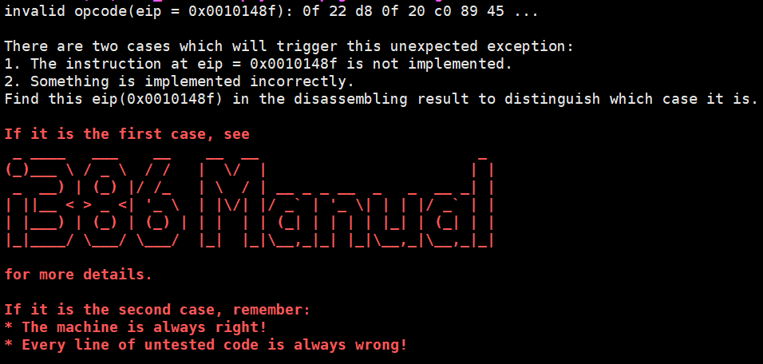
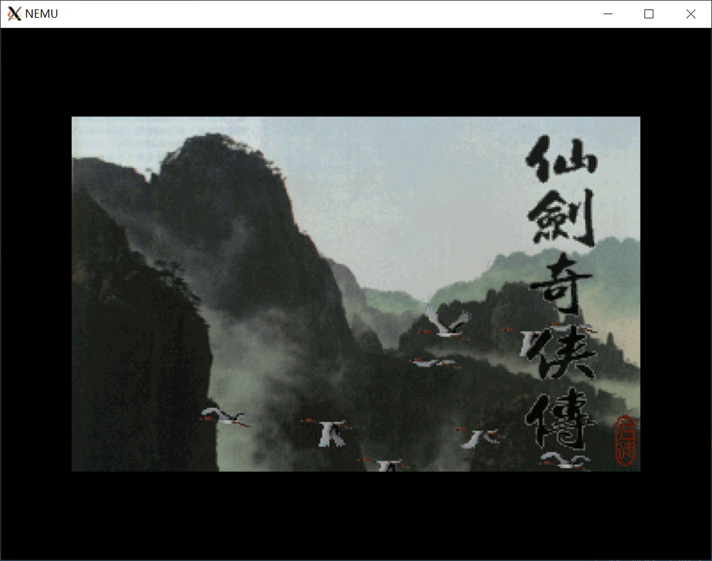
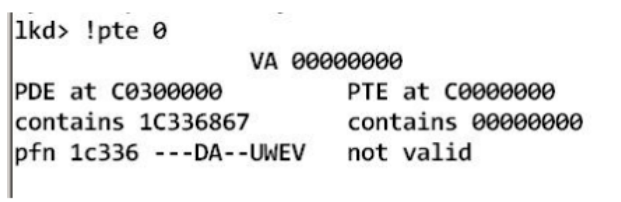
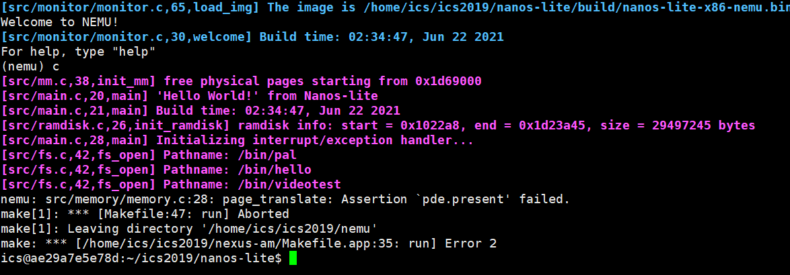
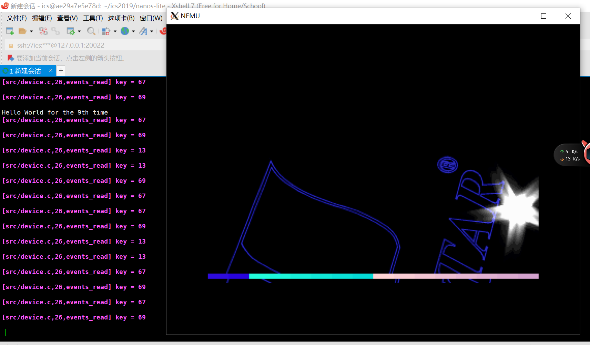

<h1 align = "center">PA4实验报告</h1>    
<div align = "center">姓名：龚卓岳</div>
<div align = "center">学号：1811358</div>

## 1.实验目的:  

>实现段式管理，并让《仙剑奇侠传》正式运行在分段管理上。
>在实现段式管理的基础上触发上下文切换，并实现分时多任务。
>支持时钟中断，完成F12任务切换。

## 2.实验过程：

### （1）段式管理：

设置CR0,CR3寄存器，并进行初始化：

```C
#include "../memory/mmu.h"
// in pa4
CR0 cr0;
CR3 cr3;
```

```C
// pa4 init
cpu.cr0.val=0x60000011;
```

完成虚拟地址转换：

```C
//封装常用操作
#define PDX(va)     (((uint32_t)(va) >> 22) & 0x3ff)
#define PTX(va)     (((uint32_t)(va) >> 12) & 0x3ff)
#define OFF(va)     ((uint32_t)(va) & 0xfff)
#define PTE_ADDR(pte)   ((uint32_t)(pte) & ~0xfff)

```

完成page_translate()：

```C
paddr_t page_translate(vaddr_t addr, bool w1r0) {
    PDE pde, *pgdir;
    PTE pte, *pgtab;

  if (cpu.cr0.protect_enable && cpu.cr0.paging) {
	    pgdir = (PDE *)(PTE_ADDR(cpu.cr3.val)); 
	    pde.val = paddr_read((paddr_t)&pgdir[PDX(addr)], 4);
	    assert(pde.present);
	    pde.accessed = 1;

	    pgtab = (PTE *)(PTE_ADDR(pde.val));
	    pte.val = paddr_read((paddr_t)&pgtab[PTX(addr)], 4);
	    assert(pte.present);
	    pte.accessed = 1;
	    pte.dirty = w1r0 ? 1 : pte.dirty;

	    return PTE_ADDR(pte.val) | OFF(addr); 
	}
  return addr;
}
```

根据指导书要求，在完成page_translate()的基础上完成vaddr_read()和vaddr_write()：

```C
uint32_t vaddr_read(vaddr_t addr, int len) {
  if ((((addr) + (len) - 1) & ~PAGE_MASK) != ((addr) & ~PAGE_MASK)) {
	  uint32_t data = 0;
	  for(int i=0;i<len;i++){
		  paddr_t paddr = page_translate(addr + i, 0);
		  data += (paddr_read(paddr, 1))<<8*i;
	  }
	  return data;
  } else {
    paddr_t paddr = page_translate(addr, 0);
    return paddr_read(paddr, len);
  }
}

void vaddr_write(vaddr_t addr, int len, uint32_t data) {
  if ((((addr) + (len) - 1) & ~PAGE_MASK) != ((addr) & ~PAGE_MASK)) {
	  for(int i=0;i<len;i++){ 
	  	paddr_t paddr = page_translate(addr + i,1);
	  	paddr_write(paddr,1,data>>8*i);
	  }
  } else {
    paddr_t paddr = page_translate(addr, 1);
    paddr_write(paddr, len, data);
  }
}
```

运行程序，发现有指令未完成：



完成指令mov_cr2r和mov_r2cr：

#### <1>指令列表中声明：

```C
make_EHelper(mov_cr2r);
make_EHelper(mov_r2cr);
```

#### <2>指令实现：

```C
make_EHelper(mov_r2cr) {
  //TODO();
  switch(id_dest->reg){
      case 0:
        cpu.cr0.val = id_src->val; break;
      case 3:
        cpu.cr3.val = id_src->val; break;
      default:
        Assert(0,"cr reg not correct!");
  }

  print_asm("movl %%%s,%%cr%d", reg_name(id_src->reg, 4), id_dest->reg);
}

make_EHelper(mov_cr2r) {
  //TODO();
  switch(id_dest->reg){
      case 0:
        operand_write(id_dest,&cpu.cr0.val); break;
      case 3:
        operand_write(id_dest,&cpu.cr3.val); break;
      default:
        Assert(0,"cr reg not correct!");
  }
```

#### <3>完成译码：

```C
/*2 byte_opcode_table */
/* 0x20 */	IDEX(G2E, mov_cr2r), EMPTY, IDEX(E2G, mov_r2cr), EMPTY,
```

### (2)让程序运行在分段机制上：

修改AM中的_map()函数，完成虚拟地址到物理地址的映射：

```C
void _map(_Protect *p, void *va, void *pa) {
  PDE *pdir = p->ptr;
  uint32_t pd_index = ((uint32_t)va)>>22&0x3ff;
  PTE *pt ;
  uint32_t pt_index = ((uint32_t)va)>>12&0x3ff;
  if(pdir[pd_index]&PTE_P)
    pt = (PTE*)(pdir[pd_index]&~0xfff);
  else {
    pt = (PTE*)(palloc_f());
    pdir[pd_index] = ((uint32_t)pt&~0xfff) | PTE_P;
  }

  pt[pt_index] = (((uint32_t)pa)&~0xfff) | PTE_P;
}
```

修改loader:

按照实验指导书修改链接地址：

```MakeFile
LDFLAGS += -Ttext 0x8048000
```

修改loader，分页加载：

```C
#define DEFAULT_ENTRY ((void *)0x8048000) //pa4

int fd = fs_open(filename,0,0);
int bytes = fs_filesz(fd); 
//fs_read(fd,DEFAULT_ENTRY,bytes);
//fs_close(fd);

//pa4
int pagenum = bytes / PGSIZE;
int bytesleft = bytes % PGSIZE;
int i;
void * page;
for(i=0;i<pagenum;i++)
{
  page = new_page();
  _map(as,DEFAULT_ENTRY+i*PGSIZE,page);
  fs_read(fd,page,PGSIZE);
}
page = new_page();
_map(as,DEFAULT_ENTRY+i*PGSIZE,page);
fs_read(fd,page,bytesleft);
fs_close(fd);
```

修改nanos-lite中main.c的代码，手动导入dummy：

```C
//uint32_t entry = loader(NULL, NULL);
//((void (*)(void))entry)();
load_prog("/bin/dummy");
```

成功运行dummy。

完善堆区管理：

在PA3中堆区管理并不是完整的，实际上当时的mm_brk函数什么都不做，只是返回了一个0，也就是段式分配管理一定成功。现在我们完善mm_brk函数，这里虚拟地址以4096位对齐：

```C
#define K4(va) (((uint32_t)(va)+0xfff) & ~0xfff)

int mm_brk(uint32_t new_brk) {
  if(current->cur_brk == 0)  current->cur_brk = current->max_brk = new_brk;
  else{
    if(new_brk > current->max_brk) {
      uint32_t brk = K4(current->max_brk);
      while(brk<new_brk) {
        _map(&current->as,(void*)brk,new_page());
        brk += PGSIZE;
      }
      current->max_brk = new_brk;
    }
    current->cur_brk = new_brk;
  }
  return 0;
}
```

修改nanos-lite中main.c的代码，手动导入《仙剑奇侠传》：

```C
//uint32_t entry = loader(NULL, NULL);
//((void (*)(void))entry)();
load_prog("/bin/pal");
```

《仙剑奇侠传》运行在分页机制上：



思考题：

1.i386 不是一个 32 位的处理器吗,为什么表项中的基地址信息只有 20 位,而不是 32 位?

因为基地址是指一个页面的首地址，20位代表具体的一页，还有低12位的页内偏移量，加在一起是32位。

2.手册上提到表项(包括 CR3)中的基地址都是物理地址,物理地址是必须的吗?能否使用虚拟地址?

物理地址是必须的，依靠CR3这个寄存器的来找到页目录的基地址，如果其中放的是虚拟地址，那么无法找到物理地址，MMU无法工作，不能完成虚拟地址和物理地址的转换。

3.为什么不采用一级页表?或者说采用一级页表会有什么缺点?

一级页表会让页表变得很庞大，对系统的内存分配产生巨大压力。

4.当程序对空指针解引用的时候,计算机内部具体都做了些什么?你对空指针的本质有什么新的认识?

```C
#include<iostream>
using namespace std;
int main(){
    int *p = NULL;
    cout << *p;
    return 0;
}
```

出现段错误。因为 NULL 处的地址并没有挂 PTE，只是单纯了挂了PDE，简而言之就是没有对应的物理页，如下图：



5.内核映射的作用:

```C
/*for (int i = 0; i < NR_PDE; i ++) {
updir[i] = kpdirs[i];
}*/
```

这段代码向用户程序的页目录表中拷贝内核的页目录表，这样用户程序和内核会共享内核部分的虚拟地址空间，也就是说，如果用户进程通过系统调用进入了内核态，不需要切换页表，就可以正常运行内核的程序。

按照实验指导书注释掉相关代码后：



注释掉代码后没有把内核页目录表拷贝过来，所以没有对应的页表来存放内核区的虚拟地址，所以就会出现这种缺页情况。

### (3)上下文切换和分时多任务；

在irq.c中加入trap事件,使用schedule调度并返回其现场指针：

```C
case _EVENT_TRAP:
      printf("here is a trap!\n");
      break;
      return schedule(r);
```

调用_trap(),进行内核自陷：

```C
init_fs();

//uint32_t entry = loader(NULL, NULL);
//((void (*)(void))entry)();
load_prog("/bin/pal");

_trap();
```

在ASYE添加相应的代码，使得irq_handle()可以识别内核自陷并包装成_EVENT_TRAP 事件：

```C
switch (tf->irq) {
    case 0x80: ev.event = _EVENT_SYSCALL; break;
    case 0x81: ev.event = _EVENT_TRAP; break;
    default: ev.event = _EVENT_ERROR; break;
}
```

实现_umake()函数：

```C
_RegSet *_umake(_Protect *p, _Area ustack, _Area kstack, void *entry, char *const argv[], char *const envp[]) {
  uint32_t *pStack = (uint32_t*)(ustack.end); 
  for(int i=0;i<8;i++)
    *(pStack--) = 0;
  
  *(pStack--) = 0x202;
  *(pStack--) = 0x8;
  *(pStack--) = (uint32_t)entry;
  *(pStack--) = 0;
  *(pStack--) = 0x81;

  for(int i=0;i<8;i++)
    *(pStack--) = 0;
  pStack++;

  return (_RegSet *)pStack;
}
```

修改trap.S:

```Asm
.globl vectrap;  vectrap:  pushl $0;  pushl $0x81; jmp asm_trap

pushl %esp
call irq_handle
#addl $4, %esp
movl %eax, %esp
```

修改_trap()函数：

```C
void _trap() {
  asm volatile("int $0x81");
}
```

实现Schedule函数，每500次运行仙剑奇侠传完成一次调度，输出一次helloworld：

```C
_RegSet* schedule(_RegSet *prev) {

  current->tf = prev;
  if(count%500!=0){
    current = &pcb[0];
    count++;
  } else {
    current = &pcb[1];
    count = 1;
  }

  _switch(&current->as);
  return current->tf;
}
```

现在可以加载两个应用了：

```C
// uint32_t entry = loader(NULL, NULL);
// ((void (*)(void))entry)();
load_prog("/bin/pal");
load_prog("/bin/hello");

_trap();
```

同时运行hello和《仙剑奇侠传》：


### (4)引入时钟中断：

加入INTR针脚：

```C
bool INTR;
```

将INTR置于高电平：

```C
void dev_raise_intr() {
  cpu.INTR = true;
}
```

在exec_wrapper()的末尾添加轮询INTR 引脚的代码, 每次执行完一条指令就查看是否有硬件中断到来:

```C
if(cpu.INTR&&cpu.eflags.IF){
  cpu.INTR = false;
  raise_intr(TIMER_IRQ,cpu.eip);
  update_eip();
}
```

修改raise_intr()中的代码, 在保存EFLAGS 寄存器后, 将其IF位置为0, 让处理器进入关中断状态.

```C
#define TIMER_IRQ 0x32
extern void raise_intr(uint8_t NO, vaddr_t ret_addr);

void raise_intr(uint8_t NO, vaddr_t ret_addr) {
    ···
    cpu.eflags.IF = 0;
    ···
}
```

在ASYE中添加时钟中断的支持,将时钟中断打包成_EVENT_IRQ_TIME事件:

```C
//irq.c
void vectime();

switch (tf->irq) {
      ···
      case 0x32: ev.event = _EVENT_IRQ_TIME; break;//4.3
      ···
}

在_asye_init() 中为时钟中断设置门描述符：

···
// -------------------- system call --------------------------
···
idt[0x32] = GATE(STS_TG32, KSEL(SEG_KCODE), vectime, DPL_USER);
```

Nanos-lite 收到_EVENT_IRQ_TIME 事件之后,直接调用schedule()进行进程调度,同时也可以去掉系统调用
之后调用的schedule()代码了:

```C
static _RegSet* do_event(_Event e, _RegSet* r) {
  switch (e.event) {
    case _EVENT_SYSCALL:
      do_syscall(r);
      //return schedule(r);
      break;
    ···
    case _EVENT_IRQ_TIME:
      return schedule(r);
    ···
  }
  return NULL;
}
```

```Asm
#trap.S

.globl vectime;  vectime:  pushl $0;  pushl $0x32; jmp asm_trap
```

### (5)分时运行和应用切换：

使用current_game管理运行的应用，按下F12时切换应用：

```C
int current_game = 0;
size_t events_read(void *buf, size_t len) {
	int key = _read_key();
	bool down = false;
	if (key & 0x8000) {
		key ^= 0x8000;
		down = true;
	}
	if (key == _KEY_NONE) {
		unsigned long t = _uptime();
		sprintf(buf, "t %d\n", t);
	}
	else {
        Log("key = %d\n", key);
		sprintf(buf, "%s %s\n", down ? "kd" : "ku", keyname[key]);
		if(key == 13 && down) {
			current_game = (current_game == 0 ? 1 : 0);
			fs_lseek(5,0,0);
		}
	}
	return strlen(buf);
}
```

在schedule中完成真正的调度：

```C
extern int current_game;

_RegSet* schedule(_RegSet *prev) {
  current->tf = prev;
  if(count%500!=0) {
    if(current_game){
      current = &pcb[0];
      count++;
    } else {
      current = &pcb[2];
      count++;
    }
  }
  else {
    current = &pcb[1];
    count = 1;
  }
  _switch(&current->as);
  return current->tf;
}
```

完成切换调度(截图时只能截到只剩最后一点videotest)：



PA4至此完成。

## 3.思考题:

请结合代码,解释分页机制和硬件中断是如何支撑仙剑奇侠传和hello 程序在我们的计算机系统(Nanos-lite, AM, NEMU)中分时运行的：

1.使用load_prog()函数加载应用程序：

```C
load_prog("/bin/pal");
load_prog("/bin/hello");
load_prog("/bin/videotest");
```

下方是这个函数的执行内容：

```C
void load_prog(const char *filename) {
  int i = nr_proc ++;
  _protect(&pcb[i].as);

  uintptr_t entry = loader(&pcb[i].as, filename);

  // TODO: remove the following three lines after you have implemented _umake()
  //_switch(&pcb[i].as);
  //current = &pcb[i];
  //((void (*)(void))entry)();

  _Area stack;
  stack.start = pcb[i].stack;
  stack.end = stack.start + sizeof(pcb[i].stack);

  pcb[i].tf = _umake(&pcb[i].as, stack, stack, (void *)entry, NULL, NULL);
}
```

先进行内核虚拟地址的映射，这一部分让不同应用的内核地址空间相同。

```C
void _protect(_Protect *p) {
  PDE *updir = (PDE*)(palloc_f());
  p->ptr = updir;
  // map kernel space
  for (int i = 0; i < NR_PDE; i ++) {
    updir[i] = kpdirs[i];
  }

  p->area.start = (void*)0x8000000;
  p->area.end = (void*)0xc0000000;
}
```

接下来使用loader完成加载，这一部分在PA3到PA4的过程中进行了多次修改，经历了直接加载磁盘，文件系统以及分页管理：

```C
uintptr_t loader(_Protect *as, const char *filename) {
  //pa3.1 
  //ramdisk_read(DEFAULT_ENTRY,0,get_ramdisk_size());

  //pa3.2
  // int fd = fs_open("/bin/text",0,0);

  //pa3.3
  int fd = fs_open(filename,0,0);
  int bytes = fs_filesz(fd); 
  //fs_read(fd,DEFAULT_ENTRY,bytes);
  //fs_close(fd);

  //pa4
  int pagenum = bytes / PGSIZE;
  int bytesleft = bytes % PGSIZE;
  int i;
  void * page;
  for(i=0;i<pagenum;i++)
  {
    page = new_page();
    _map(as,DEFAULT_ENTRY+i*PGSIZE,page);
    fs_read(fd,page,PGSIZE);
  }
  page = new_page();
  _map(as,DEFAULT_ENTRY+i*PGSIZE,page);
  fs_read(fd,page,bytesleft);
  fs_close(fd);

  return (uintptr_t)DEFAULT_ENTRY;
}
```

通过fs_open()打开文件，使用fs_filesz()获取文件大小,根据文件大小分页pagenum得到页数，剩余的字节数存储在bytesleft。

然后申请一个物理页面将DEFAULT_ENTRY+i*PGSIZE这个虚拟地址和此页面建立联系，这样当程序读取DEFAULT_ENTRY+i*PGSIZE处的数据时，系统最终会去读取此页面的物理内存。通过fs_read()读取文件到物理页。当然最后1页需要在for循环之外完成此过程。

关闭文件，返回DEFAULT_ENTRY，映射和加载完成。

之后使用_umake()创建用户进程陷阱帧，当进程被调度时，可以通过陷阱帧来保存、恢复现场:

```C
_RegSet *_umake(_Protect *p, _Area ustack, _Area kstack, void *entry, char *const argv[], char *const envp[]) {
  uint32_t *pStack = (uint32_t*)(ustack.end); 
  for(int i=0;i<8;i++)
    *(pStack--) = 0;
  
  *(pStack--) = 0x202;
  *(pStack--) = 0x8;
  *(pStack--) = (uint32_t)entry;
  *(pStack--) = 0;
  *(pStack--) = 0x81;

  for(int i=0;i<8;i++)
    *(pStack--) = 0;
  pStack++;

  return (_RegSet *)pStack;
}
```

陷阱帧由PCB记录，用于进程调度：

```C
pcb[i].tf = _umake(&pcb[i].as, stack, stack, (void *)entry, NULL, NULL);
```

同理创建剩下的进程，创建完成后调用_trap(),此函数返回一句内联汇编：

```C
void _trap() {
  asm volatile("int $0x81");
}
```

nemu使用raise_intr()进行处理：

```C
make_EHelper(int) {
  //TODO();
  raise_intr(id_dest->val,decoding.seq_eip);
  print_asm("int %s", id_dest->str);

#ifdef DIFF_TEST
  diff_test_skip_nemu();
#endif
}
```

```C
void raise_intr(uint8_t NO, vaddr_t ret_addr) {
  /* TODO: Trigger an interrupt/exception with ``NO''.
   * That is, use ``NO'' to index the IDT.
   */

  rtl_push(&cpu.eflags.val);
  cpu.eflags.IF = 0;
  rtl_push(&cpu.cs);
  rtl_push(&ret_addr);
  rtl_li(&t0,vaddr_read(cpu.idtr.idt_base+8*NO,4));
  rtl_li(&t1,vaddr_read(cpu.idtr.idt_base+8*NO+4,4));

  decoding.jmp_eip = (t0&0xffff)|(t1&0xffff0000);
  decoding.is_jmp = 1;
}
```

EFLAG、CS、和返回地址压栈，然后读取IDT表,跳转至ASYE,这一部分之前已经实现。

ASYE调用irq_handle()来处理这次异常：

```Asm
call irq_handle
```

```C
_RegSet* irq_handle(_RegSet *tf) {
  ···
      case 0x81: ev.event = _EVENT_TRAP; break;
  ···
}
```

将这次事件包装成一次_EVENT_TRAP，在do_event()中进行处理：

```C
static _RegSet* do_event(_Event e, _RegSet* r) {
    ···
    case _EVENT_TRAP:
      return schedule(r);
    ···
}
```

使用schedule()完成进程调度：

```C
_RegSet* schedule(_RegSet *prev) {
  current->tf = prev;
  if(count%500!=0) {
    if(current_game){
      current = &pcb[0];
      count++;
    } else {
      current = &pcb[2];
      count++;
    }
  }
  else {
    current = &pcb[1];
    count = 1;
  }

  _switch(&current->as);
  return current->tf;
}
```

_switch()用来切换用户进程空间：

```C
void _switch(_Protect *p) {
  set_cr3(p->ptr);
}
```

至此call irq_handle执行完成，执行trap.S中后续语句：

```ASM
movl %eax, %esp
popal
addl $8, %esp
iret
```

movl指令把新进程的陷阱帧地址赋给了esp寄存器，使用popal指令从陷阱帧中恢复新进程现场，之后程序便开始运行。

timer_intr()触发时钟中断：

```C
void timer_intr() {
  if (nemu_state == NEMU_RUNNING) {
    extern void dev_raise_intr(void);
    dev_raise_intr();
  }
}
```

其中dev_raise_intr()会将CPU的INTR置于高电平:

```C
void dev_raise_intr() {
  cpu.INTR = true;
}
```

在NEMU执行完一条指令后，会检查INTR，如果发现为1，则会调用raise_intr()触发一个时钟中断：

```C
void exec_wrapper(bool print_flag) {

decoding.seq_eip = cpu.eip;
exec_real(&decoding.seq_eip);

update_eip();
if(cpu.INTR&&cpu.eflags.IF){
  cpu.INTR = false;
  raise_intr(TIMER_IRQ,cpu.eip);
  update_eip();
}

}
```

ASYE会把异常包装成一个_EVENT_IRQ_TIME事件，直接调用schedule(),进而实现进程的切换:

```
static _RegSet* do_event(_Event e, _RegSet* r) {
    ···
    case _EVENT_IRQ_TIME:
      return schedule(r);
    ```
}
```

若是使用键盘F12完成切换，则是直接变更current_game变量：

```C
int current_game = 0;
size_t events_read(void *buf, size_t len) {
	···
	if(key == 13 && down) {
		current_game = (current_game == 0 ? 1 : 0);
		fs_lseek(5,0,0);
	}
	···
}
```

在schedule()中根据current_game的不同值切换pcb，并在switch中重新加载：

```C
_RegSet* schedule(_RegSet *prev) {
  current->tf = prev;
  if(count%500!=0) {
    if(current_game){
      current = &pcb[0];
      count++;
    } else {
      current = &pcb[2];
      count++;
    }
  }
  else {
    current = &pcb[1];
    count = 1;
  }

  _switch(&current->as);
  return current->tf;
}
```